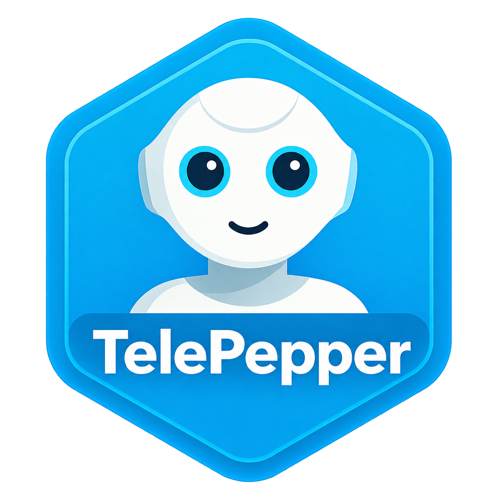

# TelePepper

[Download the 0.3.8 experimental release](https://github.com/daxx2k/pepper-tele/releases/tag/v0.3.8-test) · [Pepper 2.5 branch](https://github.com/daxx2k/pepper-tele/tree/pepper25)

TelePepper lets you control **Pepper, the wheeled humanoid robot developed by SoftBank Robotics**, using a **Meta Quest virtual reality headset**. The robot follows your head and arm movements; the headset controllers let you drive it, and live camera feeds show what the robot sees.

For **Wizard of Oz research**, an operator controls the robot's speech and behaviour while participants interact with it. TelePepper provides speech controls, gestures and lights for these interactions.

**Version 0.3.8-test — experimental prerelease.** This is a development project for operator-supervised evaluation. Automated checks do not prove physical latency, pose matching or compatibility on another robot.

## Download apps

**Ready-to-install compiled apps are available in [GitHub Releases](https://github.com/daxx2k/pepper-tele/releases/tag/v0.3.8-test). You do not need to build the source code.** An APK is an Android app installation file. On the release page, expand **Assets** if the downloads are not visible.

| Your robot software | App and device | Download |
| --- | --- | --- |
| Pepper NAOqi 2.9 | Meta Quest VR headset | [TelePepper-Quest.apk](https://github.com/daxx2k/pepper-tele/releases/download/v0.3.8-test/TelePepper-Quest.apk) |
| Pepper NAOqi 2.9 | Android tablet on the Pepper robot | [TelePepper-Pepper.apk](https://github.com/daxx2k/pepper-tele/releases/download/v0.3.8-test/TelePepper-Pepper.apk) |
| Pepper NAOqi 2.5 | Meta Quest VR headset | [TelePepper-Quest25.apk](https://github.com/daxx2k/pepper-tele/releases/download/v0.3.9-pepper25-test/TelePepper-Quest25.apk) |

For first setup, download the complete package with English instructions and installation tools:

- [Pepper 2.9 install ZIP](https://github.com/daxx2k/pepper-tele/releases/download/v0.3.8-test/TelePepper-Pepper29-install-0.3.8.zip) — includes both Quest and Pepper tablet apps.
- [Pepper 2.5 install ZIP](https://github.com/daxx2k/pepper-tele/releases/download/v0.3.9-pepper25-test/TelePepper-Pepper25-install-0.3.9.zip) — includes the Quest25 app; no Pepper Android tablet app is required.

Use the package matching your robot's NAOqi version. Source ZIPs are for developers and are not required to install the apps. [View all releases](https://github.com/daxx2k/pepper-tele/releases).

**Pepper NAOqi 2.5 users:** use the [0.3.9 connection/setup update](https://github.com/daxx2k/pepper-tele/releases/tag/v0.3.9-pepper25-test). It fixes warning-prefixed firmware replies and opens setup in the headset Home environment. The Pepper 2.9 downloads above remain on 0.3.8.

## Choose your robot software version

The numbers **2.9 and 2.5 refer to NAOqi, Pepper's robot software**, rather than different robot models. This repository contains two separate app variants. Use the `main` branch for Pepper NAOqi 2.9 with an Android tablet, and `pepper25` for Pepper NAOqi 2.5. Download the matching install ZIP from Releases; each ZIP includes English setup instructions, help, checksums and third-party notices.

| Variant | Apps to install | Head-service setup | Validation |
| --- | --- | --- | --- |
| Pepper 2.9 (`main`) | Quest APK and Pepper tablet APK | CONNECT on the tablet installs/starts the bridge | Evaluated on Quest 3 and Pepper 2.9.5.172; operator confirmed PTT arm gestures with tracking remaining active |
| Pepper 2.5 (`pepper25`) | Quest25 APK only | CONNECT on Quest installs/starts the bridge via owner SSH | Built and tested with simulation/mocks; a real Pepper 2.5 trial is still required |

A computer is only needed for initial APK installation. During operation, Quest connects directly to the robot head. No PC relay, cloud TTS API or firmware upgrade is required. Quest Pro has not been validated. Sub-40 ms physical motion latency has not been established.

## Install and operate

- [Pepper 2.9 quick start](docs/QUICKSTART.md)
- [Controls, Help and troubleshooting](docs/HELP.md)
- [Build from source](docs/BUILD.md)
- [Validation record](docs/VALIDATION.md)
- [Privacy guidance](docs/PRIVACY.md)

Install the Quest APK using Meta Quest Developer Hub (MDH). Install the tablet APK through ADB. On Pepper's tablet, CONNECT becomes START once connected. START prepares the robot; Quest START or holding A + X calibrates and engages tracking. B stops motion. Exit TelePepper confirms STOP, restores normal autonomy and ends the head service. The bridge does not start at robot boot.

Piper/Cori is the 2.9 default voice; Pepper TTS and live microphone are also available. Automatic speech gestures start OFF. Enable Gestures, then release the left push-to-talk grip to request an arm gesture while tracking is active. Head and base remain controlled independently. Both grips toggle the mode. Help is a companion panel, and app/head-service versions are visible for diagnosis.

## Architecture

- `quest/`: native OpenXR C++ dashboard/body tracking and Android speech integration.
- `pepper/tablet/`: Android configuration, pairing, deployment and participant display (2.9 only).
- `pepper/bridge/`: Python 2.7-compatible NAOqi motion, media and Wizard of Oz services.
- `config/android/`: shared Android UI and lifecycle components.
- `console/`: optional browser console.
- `tests/`: backend and standalone native regression checks.
- `tools/`: build, private setup, privacy checks and release packaging.

Control, pose, video and audio use separate connections. Motion consumes the latest pose rather than queueing older targets. Measured-pose engagement, tracking validity, STOP, watchdogs and body collision protection remain part of control. Lidar is a local sensor/odometry trace, not SLAM or a clearance guarantee. Recording and research-session export are deferred.

## Private configuration

Use your own robot addresses, SSH credentials and pairing code. Keep local settings, device captures, recordings and signing keys outside Git. Optional developer setup uses ignored `.local/pepper.properties`; see `config/pepper.properties.example`. Release APKs contain no lab pairing code or SSH password.

Run `python tools/privacy_check.py` before sharing source. GitHub APKs are debug-signed evaluation builds; rebuilding with another signing key may prevent in-place updates. No private signing keys are published.

## License

Original TelePepper code is Apache 2.0: see [LICENSE](LICENSE) and [NOTICE](NOTICE). Third-party libraries, fonts and official animation derivatives retain their own terms; see [dependency notices](docs/THIRD-PARTY.md).
